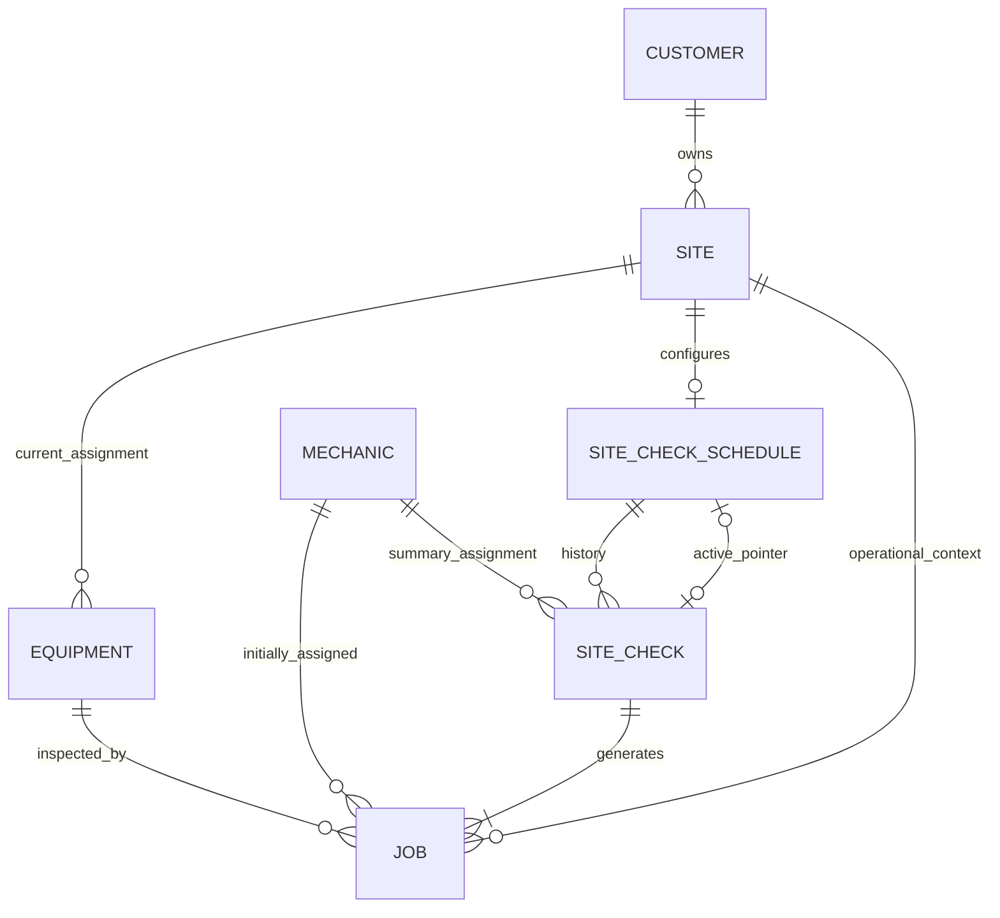
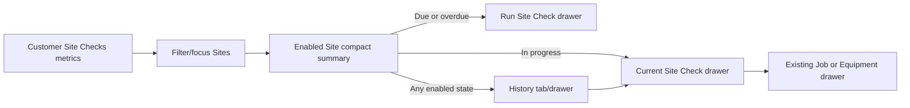
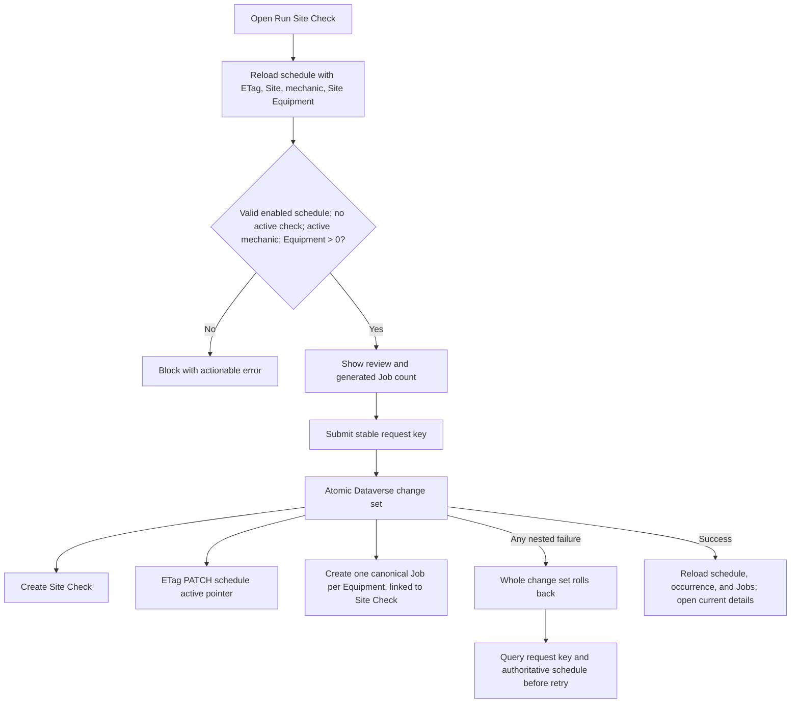
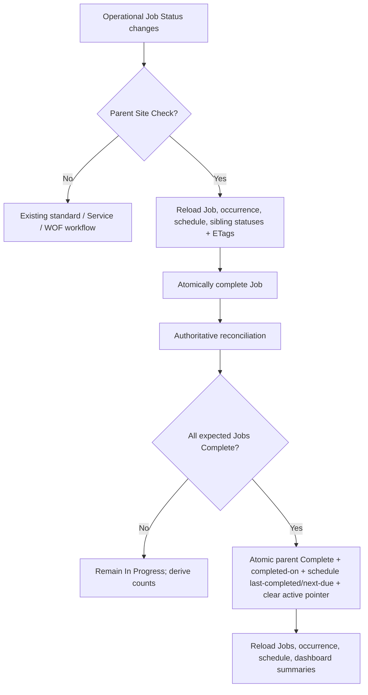
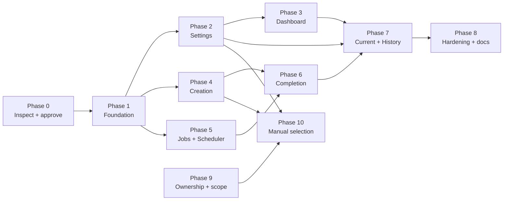

# Site Checks Implementation Plan

> **This document is the authoritative Site Checks delivery tracker. Every implementation
> task affecting Site Checks must update the phase statuses and checkboxes before completion.**

Completed checklist items must remain visible. Future changes must mark only implemented and
validated work complete, record deviations and discoveries in the relevant phase notes, and
leave unfinished work unchecked.

## Status summary

| Phase | Status | Approval gate |
| --- | --- | --- |
| 0 — Schema inspection and approval | Complete | Approved, provisioned, and verified |
| 1 — Domain and data foundation | Complete | Validated; Phase 2 unblocked |
| 2 — Site Settings | In progress | Local implementation validated; role validation pending |
| 3 — Customer Dashboard status | Complete | Validated locally |
| 4 — Site Check creation | Complete | Validated locally |
| 5 — Jobs and Scheduler integration | Complete | Validated locally |
| 6 — Progress and automatic completion | Complete | Validated locally |
| 7 — Current and historical views | Complete | Validated locally |
| 8 — Hardening and documentation | In progress | Manual release validation remains |
| 9 — Equipment ownership and scope | Complete | Provisioned, implemented, and validated locally |
| 10 — Manual Equipment selection | Complete | Provisioned, implemented, and target-verified |

Status values are **Not started**, **In progress**, **Blocked**, and **Complete**.

### Delivery efficiency and authentication guardrails

These rules apply to every phase and are part of the definition of done:

- Use local schema documentation, typed contracts, and saved verification output first.
  Live Dataverse inspection is a single approved Phase 0 session, not a series of ad hoc
  commands.
- Create one Site Checks schema tool with read-only Inspect, approved Provision, and Verify
  modes. One invocation creates one `CrmServiceClient` and reuses it; do not compose several
  `LoginPrompt=Auto` scripts.
- Never start a sign-in prompt from a Codex local-inspection task. Before the first command
  that may prompt, report the exact batched metadata/read plan and request approval once.
  A cancelled or failed sign-in is not automatically retried.
- Runtime Site Checks must use the already resolved active MSAL account and silent token
  acquisition. A page load or mutation acquires once and passes the token to its services.
  Components, rows, effects, background refreshes, and retry loops never initiate login.
- Share or coalesce in-flight schedule/occurrence requests, query related records in batches,
  honor Dataverse paging, and refresh only affected Customer/Site/Site Check/Job projections.
  Do not add another broad `fetchJobs` or `fetchEquipment` load to Customer Dashboard.
- Validate an authenticated server caller once per operation if a server workflow is later
  approved; never call `WhoAmI` per Equipment or generated Job.
- Record request-count expectations in each service test and treat new N+1 or duplicate-load
  behavior as a regression.

## 1. Purpose and scope

Site Checks are manually started recurring inspections of every applicable Equipment record
currently related to an enabled Site. The subsystem owns recurring Site configuration, an
occurrence record, generated operational Jobs, progress, rollover, and Customer Dashboard
management. It extends the existing Customer → Site → Equipment → Job model and never creates
a parallel Job implementation.

This plan is implementation-ready subject to the explicit Phase 0 approval gate. It records
known repository contracts, separates proposed schema from confirmed schema, and identifies
the few product/data decisions that must be approved before dependent implementation.

## 2. Confirmed product decisions

- Site Checks are optional per Site and configured in the combined Site Settings drawer.
- An enabled Site has exactly one schedule, with Weekly, Fortnightly, or Monthly frequency
  and a valid next due Date Only value.
- Disabling preserves schedules, Site Checks, and Jobs but removes active dashboard status,
  reporting participation, and the ability to start another occurrence.
- A Site has at most one active Site Check. A first-class **Site Check** occurrence must be
  shown by that name; “run” is acceptable only as the action phrase “Run Site Check.”
- Version 1 starts checks manually and includes all Equipment returned by the agreed Site
  Equipment query. It has no exclusion UI.
- Starting requires one technician and creates one occurrence plus one Site Check Job for
  each included Equipment. Every generated Job initially uses that technician and retains
  normal Customer/Site/Equipment/technician semantics.
- Site Check is a distinct Job Type. Equipment remains optional for ordinary Jobs and is
  mandatory for Site Check-generated Jobs.
- Operational Job Status and Job Card Status remain separate. Only operational Job Status
  `Complete` contributes to Site Check progress.
- The final completed generated Job completes the Site Check and rolls the schedule forward.
- Site Check Jobs are absent from Scheduler and the normal default Jobs workflow, but remain
  discoverable through a dedicated Jobs filter and retained as historical Jobs.
- Customer Dashboard is the primary management home. It provides compact Site summaries,
  interactive Customer totals, creation, current details, and permanent history.

## 3. Explicit non-goals

The first release does not implement automatic generation, reminders, notifications,
Equipment exclusions or rules, multiple technicians, findings, issue/no-issue outcomes,
observations, follow-on Breakdown Jobs, Quotes, photographs, attachments, PDF reports, email
summaries, compliance/KPI reporting, portal visibility, a cross-customer sidebar module,
cancellation, skipped checks, or multiple schedules per Site. It does not provision schema
as an incidental application step. Mobile and narrow-viewport responsive layouts are not a
supported product target; Site Checks follows the existing desktop application shell.

## 4. Current architecture findings

### Confirmed existing schema and contracts

| Area | Confirmed contract | Evidence/owner |
| --- | --- | --- |
| Site | `gr_site` / `gr_sites`; ID `gr_siteid`; Site → Customer navigation `gr_Customer` | `sitesApi.ts`, Customer architecture |
| Equipment | `gr_equipment` / `gr_equipments`; ID `gr_equipmentid`; Equipment → Site navigation `gr_Site` | Equipment schema/docs and `equipmentApi.ts` |
| Equipment state | `statecode = 0` is Active; `statecode = 1` is Inactive | Equipment screen/table/CSV logic |
| Job | `gr_job` / `gr_jobs`; ID `gr_jobid`; primary name `gr_jobnumber` | WOF schema and `jobsApi.ts` |
| Job lookups used by canonical create | `gr_Equipment`, `gr_Mechanic`, `gr_Site`, `gr_Contact` | `jobsApi.createJob` |
| Job Type | `gr_jobtype`, global Choice `gr_jobtypechoices` | WOF schema |
| Existing Job Type values | Breakdown `122830000`; Service `122830001`; Workshop `122830002`; WOF `122830003` | `jobType.types.ts`; WOF schema |
| Job Status values | Allocated `122830000`; Unallocated `122830001`; Waiting for parts `122830002`; Complete `122830003`; Completion Review `122830004`; Unconfirmed `122830005` | `jobStatus.types.ts` |
| Job Card Status values | Not sent `122830000`; Sent `122830001`; Submitted `122830002`; Closed `122830003` | `jobCardStatus.types.ts`; Job Card schema |
| Primary technician | Job lookup `gr_Mechanic` to `gr_mechanic`; ID `gr_mechanicid` | Job services/types |
| Additional technicians | Job Assignment child table; not used for the initial Site Check assignment | Job Assignment schema |
| Date Only handling | NZ calendar dates use `src/alpha/shared/dates/dateOnly.ts`; no timezone conversion of Date Only strings | project rule |

The Job architecture document says Jobs reference Customer and Site, while the current
canonical create payload and loaded type derive Customer through `gr_Site.gr_Customer` and
do not write a direct Customer lookup. Phase 0 must inspect live Job metadata and reconcile
this documentation/code difference. Site Check generation must call the canonical Job
payload builder and must not invent a Customer lookup.

### Current data and rule owners

- Components render, hooks coordinate, services access Dataverse, and pure domain helpers
  own calculations and validation.
- Customer Dashboard uses `useEquipmentManager` plus `useJobs`. Its Sites tab groups all
  loaded Equipment by the actual `gr_Site` relationship. It does not currently exclude
  inactive Equipment.
- The combined `SiteSettingsDrawer` keeps Details, Settings, and Bulk Add Equipment tabs
  mounted and uses shared `EditDrawerShell`, `DrawerTabs`, sections, confirmation, and
  selection patterns.
- `useJobs.updateJobStatus` and `useJobs.updateJob` are the manager-facing Job Status
  coordination points. Standard status writes currently delegate to `jobsApi`; Service
  completion uses `completeServiceJobAtomically`; WOF has a separate workflow.
- Scheduler eligibility is currently decided in `SchedulingScreen` while projecting
  `JobScheduleOption` children: a Job must exist and be operational. Its Job Type “All”
  currently literally includes every loaded Job Type.
- Jobs table status filtering begins in `JobsScreen`; type, schedule-visibility, office,
  search, and sorting filters are owned by `JobsTable`.
- Jobs current view and user-defined default view are account-scoped `sessionStorage`
  contracts. “All jobs” currently means every Job Type. Reset restores type/status/search
  while preserving the other current-view fields. Sticky-column preference is in the saved
  default. There are no per-column show/hide preferences today.
- Dataverse multi-record atomicity precedent is the delegated-browser `$batch` change set in
  `serviceCompletionApi.ts`, using ETags, `If-Match`, unique `Content-ID` values, post-failure
  authoritative reload, and idempotent success recognition.
- The server API contains authenticated-user `WhoAmI` precedent, but no general office
  workflow API. Site Check v1 does not require a new confidential server identity.
- Existing schema scripts each construct a separate `CrmServiceClient` with
  `LoginPrompt=Auto`; invoking several scripts is therefore a known repeated-prompt risk.
  Site Checks must use one combined script/connection for inspection, provisioning, publish,
  and verification.
- Customer Dashboard currently mounts both `useEquipmentManager` and `useJobs`. Each silently
  acquires a token and loads overlapping Jobs/Equipment/Sites/Customers. Site Checks must not
  add a third broad loader. Phase 1 must introduce or extend a page-level focused coordinator
  for Site Check projections and reuse already-loaded authoritative Site/Equipment data where
  freshness permits.

### “All Equipment at the Site”

For initial implementation, the agreed query is the existing shared Equipment projection
filtered by authoritative `gr_Site.gr_siteid === selectedSiteId`, with a fresh authoritative
Dataverse query immediately before creation. That currently includes both active and
inactive records because `fetchEquipment` has no state filter. This is the only conclusion
supported by the current model.

Whether inactive Equipment should be excluded is unresolved and must not be guessed. The
confirmed first-version instruction says all records from the agreed query; therefore the
initial default is **include active and inactive** unless Phase 0 product approval changes
the agreed query. The Run drawer must visibly label inactive rows/counts so managers are not
surprised. Future exclusion is documented in section 32.

## 5. Existing components, services, and workflows to reuse

| Need | Reuse/extend | Constraint |
| --- | --- | --- |
| Drawers and tabs | `EditDrawerShell`, `EditDrawerSection`, `EditDrawerConfirmation`, `DrawerTabs` | Feature owns state and writes |
| Technician selection | `SearchableSelect` or a thin Site Check adapter matching `SearchableMechanicSelect` filtering | Exclude inactive mechanics (`statecode = 1`); selection required |
| Dashboard totals | Extend `MetricStrip` with an optional button/action contract, or compose accessible buttons with its styling | Do not make a `dl` value falsely interactive |
| Site presentation | Existing compact `customer-site-card` header/expand model | Add one concise summary only for enabled Sites |
| Job navigation | Existing `JobEditDrawer` and `fetchJobForDrawer` flow | No Site Check Job editor |
| Equipment navigation | Existing `EquipmentDrawer` | Keep current relationship/history behavior |
| Job creation mapping | Extract/reuse canonical `jobsApi` payload builder and validation | Site Check-specific source permits only Site Check Type |
| Status completion | Extend Jobs completion rule owner under `src/alpha/jobs/completion/` | No component-level rollover |
| Dates | Shared NZ Date Only helpers | Monthly arithmetic must be pure and tested |
| Dataverse atomicity | `serviceCompletionApi` change-set/ETag pattern | Extract shared helper only if contracts genuinely match |

There is no generic StatusBadge, Timeline, Progress, or DataTable. Create Site Check-owned
`SiteCheckStatusIndicator`, `SiteCheckProgress`, and history/list presentation first; promote
only after a second stable consumer appears.

## 6. Proposed domain model

- `SiteCheckSchedule`: one recurring configuration for one Site. It owns enablement,
  frequency, next due date, last completed date, and a concurrency-protected pointer to the
  active occurrence.
- `SiteCheck`: immutable occurrence context plus lifecycle state. It snapshots frequency and
  due date so later schedule edits do not rewrite history.
- `Job`: existing operational record. An optional new parent Site Check lookup is populated
  and required by the protected Site Check creation workflow.
- Schedule state is derived, not independently persisted:
  - `Disabled`: schedule absent or disabled; excluded everywhere.
  - `In progress`: enabled and active occurrence pointer exists; supersedes date state.
  - `Overdue`: enabled, no active occurrence, next due date before today.
  - `Due`: enabled, no active occurrence, next due date equals today.
  - `Up to date` (also the product’s “current” umbrella): enabled, no active occurrence,
    next due date after today.
  - Invalid enabled schedule data is an error state, never treated as due/current.
- Occurrence progress is derived from its linked Jobs: total generated, operational
  `Complete`, and remaining. Stored expected count is an integrity snapshot, not the
  authoritative completed count.
- “Late” history is derived from `completed-on NZ date > due-date snapshot`.

## 7. Proposed Dataverse schema

All names in this section are **proposed and unverified until Phase 0 metadata review and
provisioning approval**. Display/logical names may be adjusted to target-environment naming
rules. No numeric values are assigned to new Choices in this document.

### Proposed table: Site Check Schedule

Proposed table `gr_sitecheckschedule`, entity set `gr_sitecheckschedules`, organisation-owned,
primary ID `gr_sitecheckscheduleid`, primary name `gr_name`.

| Business purpose | Display name | Proposed logical name | Type | Requirement/default | Relationships, index, security, migration |
| --- | --- | --- | --- | --- | --- |
| Human label | Name | `gr_name` | Text 200 | Required; generated from Site | Read operational; no backfill |
| One schedule owner | Site | `gr_Site` | Lookup → Site | Required | Alternate key on Site lookup; restrict delete; no backfill |
| Participation | Enabled | `gr_enabled` | Yes/No | Required; default No | Manager write; operational read |
| Cadence | Frequency | `gr_frequency` | Local Choice | Required when enabled; no default | Weekly/Fortnightly/Monthly, values allocated in Phase 0 |
| Due boundary | Next Due Date | `gr_nextduedate` | Date Only | Required when enabled; no default | Index for enabled/due reporting |
| Completion summary | Last Completed Date | `gr_lastcompleteddate` | Date Only | Optional | Written only by completion workflow |
| Active lock/pointer | Active Site Check | `gr_ActiveSiteCheck` | Lookup → Site Check | Optional; default null | ETag-guarded; referential/restrict behavior; operational workflow write |

The Site alternate key is the data-layer one-schedule constraint. Phase 0 must verify that
the target supports a lookup column in an alternate key and record the exact key name.

### Proposed table: Site Check

Proposed table `gr_sitecheck`, entity set `gr_sitechecks`, organisation-owned, primary ID
`gr_sitecheckid`, primary name `gr_name`.

| Business purpose | Display name | Proposed logical name | Type | Requirement/default | Relationships, index, security, migration |
| --- | --- | --- | --- | --- | --- |
| Human/history label | Name | `gr_name` | Text 200 | Required; generated | Read operational; create via workflow |
| Recurring owner | Schedule | `gr_SiteCheckSchedule` | Lookup → Schedule | Required | Index; restrict delete |
| Historical Site link | Site | `gr_Site` | Lookup → Site | Required | Index; must match schedule Site at creation |
| Assigned technician summary | Assigned Technician | `gr_AssignedTechnician` | Lookup → Mechanic | Required | Index if reporting requires; individual Jobs may later differ |
| Lifecycle | Status | `gr_status` | Local Choice | Required; default In Progress | Initial values In Progress, Complete only |
| Start timestamp | Started On | `gr_startedon` | Date and Time, UTC/user local | Required | Set once by creation workflow |
| Completion timestamp | Completed On | `gr_completedon` | Date and Time, UTC/user local | Optional | Set once by completion workflow |
| Historical cadence | Frequency Snapshot | `gr_frequencysnapshot` | Same local Choice contract | Required | Immutable after creation |
| Historical due boundary | Due Date Snapshot | `gr_duedatesnapshot` | Date Only | Required | Immutable; index for late/history queries |
| Integrity snapshot | Expected Job Count | `gr_expectedjobcount` | Whole Number, min 1 | Required | Must equal created Jobs at commit |
| Replay protection | Creation Request Key | `gr_creationrequestkey` | Text 100 | Required | Unique alternate key; never display; no PII |

Do not add Cancelled to the initial Choice unless cancellation behavior is approved. Choice
contracts may be extended later without changing occurrence identity.

### Proposed Job addition

| Business purpose | Display name | Proposed logical name | Type | Requirement/default | Relationships, index, security, migration |
| --- | --- | --- | --- | --- | --- |
| Parent occurrence | Site Check | `gr_SiteCheck` | Lookup → Site Check | Optional for Job table; required by protected Site Check creation | Index for progress; referential/restrict; existing Jobs remain null |

Add a new option **Site Check** to the confirmed global `gr_jobtypechoices`. Its numeric value
is **not proposed here** and must be read back from metadata after provisioning. Add a
`SITE_CHECK` named constant only after that value is verified.

### Keys, constraints, and relationship behavior

- Alternate key: Schedule Site lookup → one schedule per Site.
- Alternate key: Site Check Creation Request Key → replay lookup.
- Active uniqueness: Schedule `Active Site Check` is the lock. Creation atomically checks
  null via schedule ETag and sets it to the new record; it is cleared only by rollover.
- Generated Job invariant: each Job has Site Check, Site, Equipment, and initial Mechanic;
  Site and Equipment Site must match the schedule at creation.
- Dataverse requiredness cannot express “required only for one Job Type”; the protected
  service enforces this and tests it.
- Configure no cascade delete from Site/Schedule/Site Check to history or Jobs. Exact
  relationship delete behavior must be inspected and explicitly provisioned as restrict or
  referential. Operational UI exposes no delete.
- Existing records require no backfill. Do not synthesize schedules or link historical Jobs.

## 8. Data ownership and relationship diagram

Customer is derived through Site in current loaded code. Phase 0 must verify whether Job also
has a direct Customer lookup before documenting or writing one.

## 9. Job Type changes

- Extend the typed Job Type contract only after metadata confirms the new value.
- Extend labels/badges, filters, Job types, and protected creation-source validation.
- Add creation source `site-check`; it accepts only Site Check Type, and standard/WOF
  creation must reject Site Check Type. The Run workflow uses the canonical Job field
  builder inside its atomic transaction.
- Initial generated Job Status is **Allocated** because a required technician is assigned.
  Job Card Status retains its existing default (`Not sent`) and remains independent.
- Use description `Site Check — <Equipment display identifier>` unless Phase 0 approves a
  different operational naming contract. Job number generation is not present in the
  repository; generated Jobs should leave `gr_jobnumber` blank as canonical creation permits
  until the business confirms an external numbering rule. This is an approval item.
- Do not create schedule options for Site Check Jobs.

## 10. Jobs table filtering and default-view behavior

Current “All jobs” literally means all types. Adding Site Check to it would clutter the
default, while silently redefining a persisted value would change user expectations.
Implement explicit filters:

- `operational`: Breakdown, Service, Workshop, and WOF; excludes Site Check; application
  default and label **Operational**.
- numeric Site Check Type: dedicated **Site Checks** tab.
- `all`: truly unfiltered and labelled **All including Site Checks**.
- existing numeric type tabs and `unconfirmed` retain their semantics.

Version both account-scoped preference keys to v3. On one-time migration:

- v2 saved/current `selectedJobType: "all"` becomes `operational`, preserving the set of Job
  Types that existed when the preference was saved.
- numeric existing types, statuses, office filter, schedule visibility, search, sorting, and
  sticky-column preference are preserved.
- no existing value migrates to truly unfiltered `all`; users choose it explicitly.
- Reset uses the migrated/saved default and clears search exactly as today. Sorting, office
  attention, schedule visibility, and sticky/column behavior remain unchanged.
- Historical Site Check Jobs remain available through Site Checks and truly unfiltered All.

Update tests for application defaults, parsing, invalid values, migration, reset, filter
composition, sorting, and existing preference fallback.

## 11. Scheduler exclusion architecture

Create a pure Jobs-owned eligibility helper such as `jobIsSchedulerEligible(job)` beside
`jobIsOperational`. It returns false for Unconfirmed and for Site Check Type. Both:

1. Scheduler projection (`SchedulingScreen.visibleOptionsThisWeek`), and
2. schedule creation/update validation in `useJobs`/`jobScheduleApi`

must call the same rule. UI hiding alone is insufficient because a direct or stale drawer
could otherwise create a durable schedule option. Existing historical schedule options
erroneously linked to Site Check Jobs should remain stored but hidden and reported by a
Phase 5 audit; removal requires separate approval.

The Scheduler Job Type tabs must not offer Site Check. Do not use the globally expanded Job
Type option array without an explicit scheduler-eligible list.

## 12. Customer Dashboard information architecture

Only enabled schedules participate. Add four interactive Site Check metrics near the
existing Customer summary: Up to date, Due, Overdue, In progress. Activating a count:

- switches/focuses the Sites tab,
- sets a Site Check state filter,
- expands matching Sites (within the existing expansion model),
- moves focus to the filtered-results heading, and
- announces the count; zero-count controls are disabled/non-interactive.

Within each enabled Site header, add a single compact summary:

- Up to date: frequency, next due, last completed, History.
- Due/Overdue: frequency, due/overdue label, Run Site Check, History.
- In progress: technician, started date, completed/total and progress, View Current.

Expanded detail belongs in drawers, not a permanent large card. Disabled Sites render no
Site Check status. Loading, invalid schedule, empty, and failure states must not be mistaken
for disabled.

## 13. Site Settings integration

Add a dedicated `site-checks` tab to `SiteSettingsDrawer`, preserving mounted form state.
Use `FormSwitch`, Frequency select, and Date Only input. The tab shows Enabled, Weekly /
Fortnightly / Monthly, and Initial/Next due date.

- Enabling requires frequency and valid date.
- Saving disabled may preserve the existing frequency/due values in Dataverse for later
  re-enable, but `gr_enabled = false` is authoritative.
- Re-enabling validates the preserved values against current product rules.
- Disabling never clears the active occurrence, changes Jobs, or deletes history. It hides
  status/reporting and blocks new creation. If an occurrence is active, require explicit
  confirmation that work remains accessible and can still complete.
- Save schedule separately from Site details and maintenance settings so one failure does not
  imply another succeeded. After success, refresh the authoritative schedule.
- First save posts the collection and relies on the verified active Site alternate key to
  reject a concurrent duplicate; updates use ETag `If-Match` to reject concurrent settings
  edits. Do not address a lookup-based alternate-key URL because the target environment
  returns HTTP 404 for it.

## 14. Run Site Check creation workflow

Use a Site Check-owned drawer with existing drawer, section, selection, confirmation, and
list styles. It displays read-only Customer, Site, frequency, due date, all included
Equipment (including clear inactive labels under the initial query), Job count, and a
required active technician selector.

Creation is disabled when schedule is disabled/missing/invalid, technician is absent,
another active check exists, Equipment count is zero, data is stale/loading, or a request is
in progress. Disable immediately on first submit and retain one client-generated UUID
request key for every retry until success/cancel.

## 15. Duplicate prevention and replay protection

UI protection (disabled button and in-flight state) is only convenience. Authoritative
creation must:

1. Reload schedule by ID/Site with ETag; validate enabled, frequency, due date, and null
   active pointer.
2. Reload mechanic and reject inactive/missing records.
3. Query Equipment by Site immediately before building the transaction.
4. Use a stable request UUID stored in the Site Check unique alternate key.
5. Atomically create Site Check, set schedule active pointer using `If-Match`, and create all
   Jobs linked to the Site Check (using Dataverse change-set `Content-ID` references).
6. Treat a 412 or alternate-key conflict as concurrency/replay, reload, and return the
   existing occurrence only when its request key matches; otherwise report that another
   manager started the check.

Concurrent managers start from the same schedule ETag. Only one transaction can update the
active pointer; Dataverse rolls the losing change set back, including its occurrence and Jobs.

## 16. Partial-failure and retry behavior

The preferred v1 strategy is one delegated Dataverse atomic change set, following
`serviceCompletionApi.ts`. It guarantees no partial occurrence, orphan Job, partial Job set,
or duplicate retry. Validate target Dataverse maximum change-set operation count and payload
size during Phase 0. The UI must block a Site whose Equipment count would exceed the verified
safe limit and report a provisioning/architecture blocker.

Do not silently fall back to sequential Job creation. If real Site sizes exceed transaction
limits, stop and approve a revised server-orchestrated design with a staging status,
idempotent per-Equipment keys, resumable chunks, and explicit cleanup/reconciliation. That
is not part of v1 without approval.

On network/unknown outcome, query by creation request key and reload the schedule before
retry. Success means the occurrence exists, schedule points to it, and linked Job count
equals expected count. Any violated invariant is a data-integrity alert, not “success.”

## 17. Progress and completion workflow

Extend the Jobs completion owner, not components. Both `useJobs.updateJobStatus` and
`useJobs.updateJob` must route Site Check Job transitions through a new authoritative
completion/reconciliation service. Job Card status APIs remain untouched.

For a transition to operational Complete:

1. Reload Job, parent Site Check, schedule, and sibling Job IDs/statuses with ETags.
2. Validate the Job still belongs to that parent.
3. Persist Job completion through the canonical standard completion mapping.
4. If all other siblings are already Complete, include parent completion, completion
   timestamp, schedule last-completed date, calculated next due date, and clearing the
   active pointer in the same atomic change set.
5. After any generated Job completes, reload/reconcile siblings. This closes the concurrent
   “two last Jobs” race: if two transactions each observed the other incomplete, the
   post-write reconciliation sees all Complete and one ETag-guarded rollover wins.
6. On 412, reload and accept idempotent success only when every expected Job is Complete,
   the Site Check is Complete, and schedule rollover matches.

Persist no component-maintained completed count. `Expected Job Count` detects missing/extra
children; actual progress comes from linked operational Job statuses.

The existing UI permits status changes away from Complete. Behavior after a Site Check has
rolled over is unresolved: the recommended rule is to block reopening generated Jobs once
the parent is Complete, because schedule rollback semantics are undefined. Approve in Phase 0.

## 18. Next-due-date calculation rules

Use pure Date Only arithmetic and NZ calendar conversion of completion timestamp:

- Weekly: completion Date Only + 7 calendar days.
- Fortnightly: completion Date Only + 14 calendar days.
- Monthly: add one calendar month, clamping to the target month’s last day (31 Jan → 28/29
  Feb; 29 Feb → 29 Mar; 31 Mar → 30 Apr).
- No JavaScript local/UTC round-trip may shift a Date Only value.

The recommended cadence anchor is the actual completion date, not the previous due date;
late work therefore receives a full next interval and history still records that it was
late. Early completion also resets from completion. This anchor requires explicit Phase 0
product approval. Tests must cover DST boundaries, leap years, year rollover, and month end.

## 19. Current Site Check drawer

Use `EditDrawerShell` and `DrawerTabs` with Summary and Jobs/Equipment tabs (and History when
opened from a Site). Show Site, Customer derived through Site, frequency snapshot, assigned
technician, status, started/completed timestamps, total/completed/remaining, and a labelled
progress element (`<progress>` or equivalent with textual counts).

The generated list is loaded in one query/expansion, not one request per Job. Each row shows
Equipment identity, Job number/unnumbered label, operational Job Status, and the current
technician (which may differ after reassignment). Row actions open the existing Job drawer
or Equipment drawer and return focus to the invoking row on close.

## 20. Site Check History experience

History is permanent and sorted newest first, with pagination/load-more for large histories.
Each entry shows started/completed date, status, completed/total, assigned technician, due
date snapshot, and derived late/current completion indicator. Selecting an entry opens the
same details drawer in read/history context.

Do not show Cancelled or Skipped in v1. Record those labels only after lifecycle rules and
Choice values are approved. Disabled schedules retain accessible History from Site Settings
and an explicit history affordance in the Site area without presenting an active status;
this is an exception to “management information only for enabled Sites” required to satisfy
the confirmed preservation/access rule.

## 21. Customer-level summary and filtering

Aggregate only enabled schedules for the selected Customer. Prefer one schedule query
filtered through Site/Customer with active occurrence expansion, plus one grouped/batched Job
query for active occurrences. Do not issue queries per Site.

State precedence is Invalid (error, excluded from counts) → In progress → Overdue → Due →
Up to date. Summary totals must equal participating enabled schedules. Filtering affects
Site presentation only and must offer Clear filter; selecting another Customer resets the
filter to avoid hidden Sites.

## 22. Security and authorisation considerations

- Office users continue using delegated MSAL Dataverse access; no browser secret or new
  anonymous route is introduced.
- Dataverse roles need least-privilege read on schedules/checks for operational users;
  create/update schedule and start-check rights for approved managers; Job create/update and
  Mechanic/Site/Equipment read consistent with existing workflows.
- Completion-capable users need update on Site Check and Schedule because final Job
  completion rolls both forward. If that is too broad, approve an authenticated server API
  with `WhoAmI` and a dedicated constrained identity instead of weakening Dataverse roles.
- UI permission checks are advisory; Dataverse permissions and service validation are
  authoritative. Exact manager role mapping is not currently represented in the Customer
  Dashboard and is a Phase 0 decision.
- Never expose request keys as credentials; they are idempotency identifiers only. Log safe
  IDs and outcome codes, not customer/equipment payloads or tokens.

## 23. Data preservation and migration considerations

- No existing Site is enabled automatically and no historical Job is reclassified.
- New Job lookup is nullable; existing Jobs remain unchanged.
- Disabling never deletes or edits history or Jobs.
- Schedule edits do not rewrite occurrence frequency/due snapshots.
- Equipment moves after creation do not rewrite generated Job Site/Equipment context or the
  occurrence Site.
- Technician reassignment changes individual Jobs through existing workflows; occurrence
  assigned technician remains the initial summary assignment.
- Dataverse relationship delete behavior must preserve Site Checks/Jobs. No delete UI is in
  v1; any future retention process requires separate approval.
- Jobs view state uses the explicit v2→v3 migration in section 10.

## 24. Accessibility requirements

- Meet existing keyboard-accessible drawer, tab, selector, focus trap/restore, Escape, and
  confirmation patterns.
- All status uses text as well as color; Due/Overdue/In progress have programmatic labels.
- Interactive summary counts are buttons with accessible names, pressed/filter state, and
  visible focus. Announce filtered result counts.
- Progress exposes label, maximum, current value, and textual completed/remaining counts.
- Equipment and Job lists have correct table/list semantics, keyboard activation, and focus
  return after nested drawers.
- Validation errors associate with fields, focus the first error, and appear in an
  `aria-live`/alert region. Busy creation prevents duplicate activation and announces state.
- Dates include unambiguous NZ display text; Date Only inputs retain ISO values internally.
- Test desktop keyboard use, 200% zoom, reduced motion, high contrast, and screen-reader
  reading order. Mobile/narrow responsive reflow is not a release requirement; horizontal
  scrolling at unsupported viewport sizes is acceptable.

## 25. Performance and query considerations

- Add indexes/alternate keys described in schema; verify query plans after provisioning.
- Select only Site Check fields needed for summaries and expand active occurrence/technician
  where bounded.
- Batch-load generated Jobs by parent lookup and include Equipment/Site/Mechanic projections.
- Avoid reusing current `fetchJobs` for summary counts: it loads all Jobs plus submission
  child data. Add focused Site Check queries.
- Acquire one silent token per coordinated load/mutation and pass it to every participating
  Site Check service. Coalesce duplicate in-flight requests and do not retry authentication
  interactively.
- Paginate history and generated lists; honor Dataverse next links.
- Cache pure derived state only in memory and invalidate after settings, creation, Job
  status, assignment, or rollover changes.
- Verify the maximum Equipment count against Dataverse change-set limits and payload size.
- Measure Customer Dashboard query count and render performance for customers with many
  Sites and history.
- Define request budgets before implementation: Customer switch adds at most one focused
  schedule/active-occurrence request plus one batched active-progress request; opening
  history/details adds only its paged query; a mutation performs its authoritative preflight,
  one atomic write, and one affected-projection refresh.

## 26. Testing strategy

### Domain tests

- Schedule state: disabled, invalid, in progress precedence, due equality, overdue before
  today, up-to-date after today.
- Weekly/fortnightly/monthly next due, leap year, month end, year end, DST-safe NZ Date Only.
- Progress total/complete/remaining uses operational Job Status only; Job Card Submitted/
  Closed does not count.
- Late derivation and expected-count integrity mismatch.
- Scheduler eligibility and Jobs filter semantics.

### Service/integration tests

- Schedule create/update, alternate-key conflict, ETag conflict, disabled/missing schedule.
- Creation success; zero Equipment; missing/inactive technician; all current Site Equipment;
  inactive Equipment behavior locked to the approved query.
- Double-click, same-key retry, unknown network result, different-key concurrent managers,
  and losing transaction leaves zero records.
- Inject failure at each Job create and schedule pointer operation; assert no occurrence,
  Jobs, or pointer changes.
- Generated Jobs have Type, parent, Site, Equipment, and initial technician; ordinary Jobs
  still allow Equipment null.
- Completion through table status and edit drawer; final Job rollover; simultaneous last
  Jobs; retry after 412; Job Card status alone has no effect.
- Jobs default Operational exclusion, dedicated Site Checks, truly unfiltered All,
  persisted-view migration/reset/sort/status/office/schedule/sticky compatibility.
- Scheduler hides Site Check options and rejects new schedule creation for them.
- Disable/re-enable preserves history/Jobs and reporting participation.

### Component/end-to-end tests

- Site Settings validation, save failure, active-check disable confirmation.
- Dashboard state summaries/counts/filter/focus, concise Site content, invalid/loading/error.
- Run drawer review, busy state, required selector, zero rows, retry messaging.
- Current/history drawers, progress, nested Job/Equipment navigation, pagination.
- Keyboard-only tabs/selectors/actions, focus return, live announcements, status without
  color, and desktop 200% zoom.

Use deterministic fake current dates and mocked Dataverse responses. Add a focused test
script to `package.json` and include it in `npm test`. Phase validation also runs lint, build,
and `git diff --check`.

## 27. Documentation updates required

Authoritative owners to update with implementation:

- `docs/architecture/customer-dashboard.md`: Site summary, counts, settings, current/history.
- `docs/architecture/jobs.md`: Site Check Type/source, parent lookup, completion integration,
  Jobs view semantics.
- `docs/architecture/scheduler.md`: shared eligibility rule/exclusion.
- `docs/architecture/equipment.md`: approved Site Equipment inclusion behavior only.
- `docs/architecture/dataverse.md`: new relationships and atomic workflows.
- `docs/architecture/reusable-components.md`: only newly stable reusable contracts/rule owners.
- A new detailed provisioned schema document (recommended
  `docs/site-checks-dataverse-schema.md`) after Phase 0 approval/provisioning; link rather
  than duplicate exact provisioned contracts here.
- `docs/README.md`: link architecture/schema when they exist.
- `TODO.md`, `CURRENT_STATE.md`, and `CHANGELOG.md` only according to their existing ownership.
- User/operator documentation for settings, running, reassignment, completion, filters, and
  history in Phase 8.

## 28. Deployment and Dataverse provisioning dependencies

No provisioning occurs in this planning task. After Phase 0 approval:

1. Create an idempotent provisioning/verification script following existing scripts.
2. Add tables, fields, Choice options, lookups, relationship delete behavior, alternate
   keys/indexes, and solution membership.
3. Publish, read metadata back, and record exact logical/entity-set/navigation/key/Choice
   values in the schema document.
4. Update security roles and validate with manager and completion-capable non-admin users.
5. Run provisioning twice to prove idempotency and export an audit without customer data.
6. Deploy application phases only after schema exists in each target environment.
7. Use feature release sequencing so code never queries missing schema.

Rollback disables/hides the application feature but preserves provisioned tables and data.
Do not roll back by deleting Site Checks or generated Jobs.

## 29. Risks, unresolved questions, and decisions requiring approval

| Item | Recommendation | Blocking phase |
| --- | --- | --- |
| Inactive Equipment inclusion | Initial query includes active and inactive, visibly labelled; approve or change query in Phase 0 | 4 |
| Completion cadence anchor | Actual completion NZ date | 1/6 |
| Due semantics | Due only when next due equals today; no “due soon” window | 1/3 |
| Reopening completed Site Check Jobs | Prohibit after parent completion until rollback semantics exist | 6 |
| Job number for generated Jobs | Leave blank; do not invent numbering | 4 |
| Direct Job Customer lookup | Inspect metadata; use canonical Job mapping only | 0/4 |
| Manager authorisation owner | Define Dataverse role(s) and any app affordance checks | 2/4 |
| Maximum Equipment/transaction size | Verify live Dataverse safe limit and largest Site | 0/4 |
| Relationship delete behavior | Explicit restrict/referential; verify navigation names | 0 |
| Choice numeric values | Allocate/provision/read back; never guess | 0 |
| Disabled Site history entry point | Keep History accessible without active status | 3/7 |
| Cancellation/skipping | Deferred; no initial status or behavior | Future |

The largest architectural risk is any workflow that can update a generated Job Status
without using the extended completion owner. Phase 6 must inventory all status mutation
entry points and add service-level enforcement/tests before release.

## 30. Future extension points

- Automatic generation can invoke the same idempotent protected creation command with a
  deterministic schedule/period key; it must not create a second workflow.
- Reminders/notifications consume derived schedule states and immutable occurrence IDs.
- Equipment rules can become a pure inclusion policy returning included/excluded reasons;
  remembered exclusions need a separate relationship table.
- Multiple technicians can extend Job Assignments while retaining initial technician
  snapshots.
- Findings should be occurrence/Equipment children; findings may explicitly create normal
  Breakdown Jobs or Quotes through their canonical workflows.
- Photos use the generic Job Photo architecture where Job evidence fits; occurrence-level
  attachments require an approved contract.
- Reports, email, compliance/KPI dashboards, portal, and cross-customer modules read the same
  schedules/occurrences/Jobs.
- Cancellation/skipping require status, schedule advancement, active-lock release, audit,
  and permission decisions.
- Multiple schedules per Site require replacing the Site alternate key and moving the active
  lock/uniqueness scope to schedule; current occurrence → schedule ownership already supports
  that migration.

## 31. Phased implementation checklist

### Phase 0 — Schema inspection and approval

Status: **Complete**

- [x] Complete local Phase 0 audit of documented/source schema contracts, current auth
  patterns, and existing provisioning conventions without accessing Dataverse.
- [x] Record the repeated-prompt risk from per-script `LoginPrompt=Auto` connections and the
  requirement for one combined Site Checks schema session/tool.
- [x] Record runtime silent-token, request-coalescing, focused-query, and no-interactive-retry
  constraints.
- [x] Add and locally validate one read-only Site Checks metadata inspection tool with one
  connection, one metadata request, cached-session/no-prompt default, and optional aggregate
  transaction-sizing profile.
- [x] Create the proposed Site Checks schema specification and provisioning approval gate.
- [x] Inspect live metadata for Site, Equipment, Job, Mechanic, existing relationships,
  navigation properties, ownership, state/status, and solution membership.
- [x] Reconcile whether Job has a direct Customer lookup and document the canonical rule.
- [x] Verify all existing Job Type, Job Status, and Job Card Status values against metadata.
- [x] Confirm proposed table/column/logical/entity-set/navigation names and relationship
  delete behavior.
- [x] Allocate proposed Choice values without collision and document them for approval.
- [x] Verify Lookup alternate-key support, change-set Content-ID binding, the 1,000-operation
  batch limit, and the largest Equipment count per Site.
- [x] Measure the fully constructed 22-Equipment creation payload against the approved
  request-size boundary before Phase 4 release.
- [x] Audit actively assigned security roles and document the exact least-privilege delta.
- [x] Approve, provision, and verify the Service Operations Site Check privileges.
- [x] Approve inactive Equipment, due boundary, cadence anchor, reopening, Job numbering,
  disabled-history access, and transaction-limit decisions.
- [x] Produce/review the exact provisioning and migration specification.
- [x] Stop and obtain explicit approval before provisioning or schema-dependent implementation.

Implementation notes/deviations:

- 26 July 2026: Phase 0 began with local read-only inspection only. No Dataverse connection,
  sign-in prompt, metadata request, or write was made.
- Local inspection initially reconfirmed documented contracts; the later single cached-session
  inspection completed the live metadata verification.
- Existing provisioning scripts are idempotent in scope but each creates its own interactive-
  capable `CrmServiceClient`. The combined Site Checks schema tool consolidates inspection,
  provisioning, publish, and verification behind one connection and defaults to Inspect.
- Runtime inspection found overlapping Customer Dashboard coordinators. Site Checks will not
  add another broad Jobs/Equipment load; Phase 1 must use focused queries and one token per
  coordinated operation.
- `scripts/manage-site-checks-schema.ps1` passed PowerShell parsing, offline definition
  validation, and offline Dataverse SDK type validation. Its default `LoginPrompt=Never`
  cannot deliberately open a prompt; no live mode was invoked.
- `docs/site-checks-dataverse-schema.md` now owns the detailed inspected/design-approved
  schema. Security privileges were still pending at this checkpoint and were later audited,
  approved, provisioned, and verified as recorded below.
- The cached-session live inspection completed with no prompt and no writes. It confirmed
  all four existing tables are user-owned and in `ServiceOperationsNew`, Site primary name
  is `gr_address`, Equipment primary name is `gr_fleet`, and Job has no direct Customer
  lookup. Site Checks must continue deriving Customer through Job Site.
- Existing Job Type values end at WOF `122830003`; Site Check `122830004` is the proposed
  unused next global option. Proposed local Frequency and Status values are recorded in the
  schema document but remain unprovisioned.
- Dataverse labels Job Status `122830004` as Review while the application currently displays
  Completion Review. This pre-existing label mismatch is recorded and is not silently
  changed by Site Checks.
- The largest Site has 22 Equipment. The fully constructed representative request is 24
  operations and 15,820 UTF-8 bytes. This is below both the documented 1,000-request limit
  and the application's conservative 4 MiB atomic-request guard. The guard fails before any
  request rather than falling back to partial sequential creation.
- 26 July 2026: the user approved the documented product decisions and exact proposed schema,
  including organisation ownership, Restrict relationships, alternate keys, Choice values,
  inactive-Equipment inclusion, completion-date cadence, due boundaries, no reopening,
  blank generated Job numbers, and disabled-site history access. This is design approval,
  not permission to mutate Dataverse.
- The combined `scripts/manage-site-checks-schema.ps1` now owns Inspect, Provision, and Verify
  modes. Provision is inert unless explicitly selected, uses one connection, defaults to
  cached authentication with no prompt, publishes once, and verifies in the same process.
  Provision ran once after explicit approval on 26 July 2026; no separate Verify live mode
  has yet been run.
- 26 July 2026 provisioning reused one cached connection without a prompt. It created both
  tables, all approved columns and relationships, Job Type `122830004`, and both alternate
  keys; published once; and passed structural read-back verification. Alternate-key Active
  status remains pending one later cached read-only Verify call. No roles or application code
  were changed.
- A single later cached read-only Verify call confirmed the complete structural contract and
  both alternate keys as Active. It opened no prompt and performed no writes.

### Phase 1 — Domain and data foundation

Status: **Complete**

- [x] Provision approved schema through an idempotent script in a separately authorised task.
- [x] Confirm both alternate keys are Active through one cached read-only Verify call;
  publish and structural contract verification passed and is recorded in the schema document.
- [x] Add typed schedule, occurrence, Choice, lookup, and Job parent contracts.
- [x] Add focused Site Check Dataverse query/mapping services.
- [x] Add a Site Checks page-data hook that acquires one silent token, coalesces in-flight
  loads, and stays within documented request budgets.
- [x] Implement pure schedule-state and validation helpers.
- [x] Implement NZ-safe next-due calculations.
- [x] Implement progress/integrity and late-state calculations.
- [x] Implement duplicate-active and request-key validation helpers.
- [x] Add domain/service tests for all Phase 1 rules.

Implementation notes/deviations:

- 26 July 2026: added feature-owned typed contracts and pure domain helpers under
  `src/alpha/site-checks/`. Date Only arithmetic is UTC-calendar based and never round-trips
  stored dates through the local timezone. Monthly cadence clamps to the target month end.
- Progress counts only operational `Job Status = Complete`; Job Card Status is not accepted
  by the calculation contract. Completion requires the actual child count to match the
  immutable expected count.
- Added eight focused tests covering invalid dates, leap/month/year boundaries, completion-
  date cadence, enabled validation, all schedule states, Job Status separation, integrity
  mismatch, final completion, and late history. Full regression tests, lint, build, and
  `git diff --check` passed. The build retains its existing large-chunk advisory.
- Added focused, batched-by-ID read services for schedules, active occurrences, and generated
  Job progress. They deduplicate scopes, return immediately for empty scopes, explicitly map
  ETags/lookups, and expose safe errors without upstream response bodies.
- Added a framework-neutral data coordinator that acquires one supplied silent token,
  coalesces identical concurrent Site scopes, then loads schedules followed by active
  occurrences and Job progress in parallel. Page-hook mounting remains open so authentication
  interaction handling stays with the existing MSAL owner.
- Start validation now blocks missing/disabled/invalid/stale schedules, active occurrences,
  missing technicians, zero Equipment, invalid UUID request keys, and an in-flight submit.
  Conflict classification distinguishes an idempotent request-key replay from another
  manager's active occurrence.
- Site Check coverage now contains 14 passing tests, including request deduplication,
  zero-request empty scopes, safe service failures, one-token coalescing, and replay/conflict
  classification. The full repository regression suite remains green.
- Added `useSiteChecks`, which resolves only the active MSAL account, calls
  `acquireTokenSilent`, exposes interaction-required state for an explicit user action, and
  contains no redirect, popup, or automatic interactive retry. It cancels stale state
  application when scopes change and exposes a focused refresh.
- The hook is not mounted early into the existing broad Customer Dashboard loaders. Phase 2
  or 3 will activate it with the selected Site scope when the corresponding UI is present
  and role access can be validated, preventing premature background failures and duplicate
  page-wide reads.
- Phase 1 completed with 15 focused tests plus the full repository regression suite, lint,
  production build, and `git diff --check` passing.

### Phase 2 — Site Settings

Status: **Complete**

- [x] Add mounted Site Checks tab/section to combined Site Settings.
- [x] Add enable switch, frequency, due date, validation, dirty state, and errors.
- [x] Implement alternate-key-enforced create and ID/ETag update concurrency.
- [x] Add disable-with-active-check confirmation and preservation behavior.
- [x] Refresh authoritative schedule after save.
- [x] Add local component/service tests.
- [ ] Validate Site Settings read/create/update with an assigned non-admin Service Operations
  user; metadata grants are provisioned and verified, but an end-user smoke test remains.
- [x] Update tracker and owning architecture/schema docs.

Implementation notes/deviations:

- 26 July 2026: added the Site Checks tab to the combined Site Settings drawer using
  `FormSwitch`, the verified frequency choices, and a Date Only input. Tab panels remain
  mounted, and Site Check dirty state participates in discard confirmation without coupling
  its save to Site details or maintenance settings.
- The focused hook is activated only while a Site Settings drawer is open and requests only
  that Site. First save posts the collection and lets the active one-Site alternate key
  reject a concurrent duplicate; updates use the record ID and loaded `If-Match` ETag. A
  successful mutation reloads the authoritative schedule using the same silently acquired
  token.
- Disabling retains frequency/due values. If an active occurrence exists, confirmation
  explains that its Jobs remain accessible and completable while the Site leaves reporting
  and cannot start another check.
- Added schedule validation and persistence tests for create-only key semantics, relationship
  binding, preserved disabled cadence, stale ETag errors, and zero-write invalid input.
  Customer Dashboard source-contract tests cover the mounted tab, switch, date field,
  confirmation, and focused hook scope.
- Full regression tests, lint, build, and `git diff --check` pass. Runtime verification with
  a least-privilege non-admin remains open; no live schedule mutation was performed in this
  phase.
- 26 July 2026 target validation found that addressing the lookup alternate key directly
  returns Dataverse HTTP 404 even though the key is Active. First-create transport was
  corrected to a collection POST; the active alternate key remains the authoritative
  concurrent duplicate constraint. Unknown failures expose only the safe numeric HTTP
  status and never the Dataverse response body.
- The first cached read-only `AuditSecurity` invocation connected with no prompt and made no
  role changes, but its report formatter failed when PowerShell returned one role as a scalar.
  The local array-normalisation fix is complete. In accordance with the no-repeated-prompt/
  request rule, no automatic live retry was made; one explicitly approved retry remains.
- The explicitly approved retry succeeded with one cached connection and no writes. The only
  actively assigned unmanaged human role is `Service Operations`; it has the necessary
  global Job/Site/Equipment/Mechanic privileges but no privileges on either Site Check table.
  The proposed version 1 delta is organisation-depth Create/Read/Write/Append/Append To on
  both Site Check tables, with no Delete/Assign/Share and no assignment changes. An
  idempotent `ProvisionSecurity` mode was prepared but had not yet been run.
- After explicit approval, `ProvisionSecurity` added exactly ten organisation-depth grants
  to Service Operations and verified them in the same cached, no-prompt connection. No
  Delete/Assign/Share privilege or user assignment changed.
- On 26 July 2026 the signed-in target-environment session created and authoritatively
  reloaded an enabled Monthly Schedule for Air New Zealand / Can Park Auckland with a
  26 July 2026 due date. This proves the corrected collection-POST create transport and
  runtime privileges for the signed-in account. It does not prove that account is a
  least-privilege non-admin, so the assigned-non-admin checklist item remains open.

### Phase 3 — Customer Dashboard status

Status: **Complete**

- [x] Load schedules/active occurrences without N+1 queries.
- [x] Add enabled-Site compact state presentation.
- [x] Add interactive Customer Up to date/Due/Overdue/In progress totals.
- [x] Implement Site filtering, expansion, focus, clear/reset, and announcements.
- [x] Add invalid/loading/empty/failure states.
- [x] Test date boundaries, count totals, disabled exclusion, and accessibility.
- [x] Update tracker and Customer Dashboard architecture.

Implementation notes/deviations: The existing Site Settings-only scope was widened to one
persisted-Site ID set for the selected Customer. The same hook snapshot now serves the
dashboard and open settings drawer, and a save reloads that complete scope so sibling Site
summaries are not discarded. No broad Job or Equipment loader and no interactive sign-in
path were added. `MetricStrip` gained an optional, backward-compatible accessible value
activation contract; Site Check filtering remains owned by Customer Dashboard.
Selecting a count expands matching Sites and moves focus to the Sites heading after switching
tabs; selecting the active count again or using Clear filter restores the full Site list.

### Phase 4 — Site Check creation

Status: **Complete**

- [x] Build Run Site Check drawer with required review fields and technician selector.
- [x] Reload/validate authoritative schedule, mechanic, and Equipment on submit. (Site
  identity is the verified schedule Site lookup; Customer remains derived through Site.)
- [x] Extract/reuse canonical Job payload building with protected Site Check source.
- [x] Implement stable request key and atomic occurrence/pointer/all-Jobs transaction.
- [x] Implement 412, alternate-key, network-unknown, retry, and invariant reconciliation.
- [x] Block zero Equipment, invalid/disabled schedule, active occurrence, and unsafe size.
- [x] Test double-click, retry, concurrent managers, injected partial failures, relationships,
  and inactive Equipment behavior.
- [x] Reload/open authoritative current Site Check after success.
- [x] Update tracker and architecture/schema docs.

Implementation notes/deviations: `jobsApi` now exposes its canonical create-payload builder.
Site Check `122830004` is protected behind the `site-check` creation source and is excluded
from ordinary Job Type options. The atomic service builds one occurrence POST, one
ETag-guarded schedule pointer PATCH, and one canonical allocated Job POST per Equipment,
using Content-ID `$1` relationships. A 22-Equipment fixture produces 24 operations and
15,820 bytes; inactive Equipment remains included. Authoritative preflight re-reads the
schedule with ETag, all Site Equipment,
and the selected mechanic using one supplied token. It rejects missing/inactive mechanics,
zero Equipment, disabled/incomplete schedules, and an active occurrence. Every result,
including an unknown network outcome, is reconciled by request key, schedule pointer, and
exact linked-Job count before success is returned. More injected concurrency/failure cases
remain open. The Customer Dashboard now exposes Run Site Check only for Due/Overdue Sites.
The shared-pattern drawer shows Customer, Site, frequency, due date, required active
technician selection, all preview Equipment, inactive labels, and exact Job count. Its UUID
and started timestamp are created once per drawer session and retained across explicit
retries; cancel/new drawer creates a new identity. Submit busy state blocks double-clicks,
and the hook refreshes the complete selected-Customer Site Check projection using the same
token after confirmed success.
Replay now performs one request-key lookup, then validates only the schedule pointer and
linked Job count; it does not reload Equipment/mechanic or execute the change set. A new
request performs the three authoritative preflight reads in parallel. An already-active
schedule is rejected without a second request-key lookup. Tests cover same-key replay,
unknown outcome, active concurrent manager, inactive mechanic, nested 412 rollback,
partial-Job integrity mismatch, protected relationships, inactive Equipment, and busy
double-click prevention. Confirmed success now opens the authoritative occurrence in the
Phase 7 details drawer after the customer-scoped projection refresh.
Target-environment validation on 26 July 2026 created one occurrence for Air New Zealand /
Can Park Auckland and exactly three generated Jobs for FN1579, FN2461, and FN2464, all
initially Allocated to Anura. The dedicated Jobs view showed the records while Operational
Jobs and Scheduler excluded them. No duplicate occurrence or orphan Job was observed.

### Phase 5 — Jobs and Scheduler integration

Status: **Complete**

- [x] Add verified Site Check Job Type constant/labels and creation restrictions.
- [x] Add Operational, Site Checks, and truly unfiltered All Jobs filters.
- [x] Version/migrate persisted current/default view and preserve reset/sort/status/office/
  schedule/sticky behavior.
- [x] Implement shared Scheduler eligibility helper.
- [x] Apply eligibility to Scheduler projection and schedule mutation validation.
- [x] Remove Site Check from Scheduler tabs and audit erroneous existing schedule options.
- [x] Add Jobs/Scheduler/persistence regression tests.
- [x] Update tracker and Jobs/Scheduler architecture.

Implementation notes/deviations: Jobs view state is versioned v3 and saved defaults v2.
Legacy current/default `all` migrates to `operational`, preserving the pre-Site-Checks type
set, statuses, search, office/scheduled filters, sorting, and sticky-column preference.
Operational is the application default and excludes only Site Check Type; Site Checks has a
dedicated numeric-type tab; All jobs is explicitly truly unfiltered by type. The shared
Jobs-owned `jobIsSchedulerEligible` excludes Unconfirmed and Site Check Jobs. Scheduler
projection, create, confirm, and update paths use it; Scheduler tabs use a Site-Check-free
option list. Historical erroneous schedule options remain stored and hidden, with a
non-destructive weekly audit count shown for review.

### Phase 6 — Progress and automatic completion

Status: **Complete**

- [x] Inventory every operational Job Status mutation entry point.
- [x] Route Site Check Job completion through the Jobs completion owner.
- [x] Implement authoritative sibling queries and expected-count integrity checks.
- [x] Implement atomic final rollover and post-write concurrent-last-job reconciliation.
- [x] Keep Job Card Status completely independent.
- [x] Enforce approved reopen behavior.
- [x] Refresh Jobs, occurrence, schedule, and dashboard state after mutation.
- [x] Test table/edit completion, Job Card separation, last Job, concurrent last Jobs, 412,
  retry/idempotency, and rollover calculations.
- [x] Update tracker and completion architecture.

Implementation notes/deviations: `useJobs` remains the single client owner for operational
status mutation. Both inline table status changes and full drawer saves route generated
Jobs to `siteCheckCompletionApi`; the separate Job Card Status method remains untouched.
The completion service reloads the Job, parent occurrence, Schedule, and all siblings,
checks the immutable expected count, and uses ETags. The final Job, occurrence completion,
and Schedule rollover are one Dataverse change set. A post-write reconciliation handles
two managers completing different final Jobs concurrently and safely recognizes a 412
whose competing transaction already committed. The Schedule rolls from the New Zealand
Date Only of completion using the occurrence frequency snapshot. Completed occurrences
block generated Job reopening. Drawer saves may reassign the technician through the
canonical Job fields, but must retain the protected Site Check Job Type and the original
Site and Equipment relationships. Jobs refresh authoritatively after every mutation and a
silent-only invalidation refreshes any mounted Customer Dashboard Site Checks projection;
no interactive authentication path was added.
Target-environment completion validation on 26 July 2026 changed FN1579, FN2461, and FN2464
through the Jobs-owned operational status controls. The first two advanced progress; the
third atomically completed the occurrence and rolled the Monthly Schedule from 26 July to
26 August 2026. The Customer summary then showed Up to date `1`, Due `0`, Overdue `0`, and
In progress `0`. Job Card Status was not used for this test.

### Phase 7 — Current and historical views

Status: **Complete**

- [x] Build Site Check details drawer with accessible tabs and progress.
- [x] Load generated Job/Equipment rows in bounded queries with pagination.
- [x] Integrate existing Job and Equipment drawers with focus return.
- [x] Build permanent paginated history timeline/list and late derivation.
- [x] Preserve history access when schedule is disabled.
- [x] Test current/completed/invalid integrity states, navigation, keyboard use, and history.
- [x] Update tracker and Customer Dashboard architecture.

Implementation notes/deviations: `SiteCheckDetailsDrawer` reuses `EditDrawerShell`,
`EditDrawerSection`, and keyboard-operable `DrawerTabs` for Summary, Jobs & Equipment, and
History. It shows occurrence snapshots, assigned technician, labelled native progress,
integrity mismatch warnings, and the generated rows. History and rows use Dataverse
continuation links with 25-record pages; generated rows expand Equipment and current
technician in the same query rather than issuing per-row requests. Continuation links are
accepted only from the configured Dataverse API origin. Current, post-start, and permanent
history entry points share the drawer. History remains visible for disabled schedules.
Rows open the canonical Job and Equipment drawers over the retained details drawer and
restore focus on close. Concurrent initial history/detail reads coalesce silent token
acquisition; components and retry paths never initiate interactive authentication.
The same target-environment completion pass verified permanent History access for Can Park
Auckland. History displayed the completed occurrence as `Complete · 3/3`, technician Anura,
and the original 26 July 2026 due date. All three historical generated Jobs remained visible
and Complete in the dedicated Site Check Jobs view.

### Phase 8 — Hardening and documentation

Status: **In progress**

- [ ] Run concurrency/load testing at verified maximum Site size.
- [x] Verify request budgets, absence of N+1/duplicate loads, one-token-per-operation behavior,
  and no automatic interactive sign-in paths.
- [ ] Validate query counts, paging, indexes, and Customer Dashboard performance.
- [ ] Complete the desktop accessibility audit for keyboard, screen reader, and 200% zoom.
- [x] Run full regression tests, lint, build, and `git diff --check`.
- [ ] Validate manager and completion flows with least-privilege non-admin accounts.
- [ ] Validate historical preservation, disable/re-enable, and deployment rollback.
- [x] Complete all architecture, schema, user, operator, index, state, backlog, and changelog
  updates owned by the release.
- [x] Record final deviations/new work; leave any unfinished checkbox open.

Implementation notes/deviations: Offline hardening confirms the 22-Equipment creation
fixture remains 24 atomic operations and 15,820 bytes, dashboard reads are batched by
customer scope, detail/history reads are 25-record pages, expanded rows avoid N+1, and
concurrent initial drawer reads coalesce one in-flight silent token request. Source-contract
tests confirm no Site Check runtime path contains an interactive authentication call or
DELETE request. Disable/re-enable payload tests preserve cadence and never clear the active
pointer or history. `docs/site-checks-operations.md` now owns release request budgets,
one-session non-admin smoke steps, and non-destructive rollback.

Phase 8 remains In progress. The following checks require an authorised target-environment
session and must not be inferred from local tests: maximum-Site runtime/load observation,
least-privilege non-admin manager/completion smoke testing, and deployment/rollback review.
Keyboard, screen-reader, and desktop 200% zoom manual validation also remains open.
These should be combined into one planned user session where possible; failure or cancelled
authentication must not be automatically retried. Architecture, schema, operator, index,
and current-state documentation are updated; the release changelog entry remains correctly
deferred until the feature passes its release gates.

Rendered local validation reached the Microsoft entry screen but did not initiate sign-in,
consistent with the no-prompt rule. The offline keyboard audit hardened the shared drawer:
each dialog now has a unique accessible title relationship, receives initial programmatic
focus, closes with Escape when safe, contains forward/reverse Tab navigation, and exposes
consistent focus-visible styling. Site Check details now restore focus to their Current or
History dashboard trigger as well as restoring row focus after nested Job/Equipment
drawers. The feature-specific rendered screen-reader/desktop-zoom audit remains open
because authenticated feature data was unavailable without starting the prohibited sign-in.

On 26 July 2026 an existing authenticated Codex-browser session completed the first
read-only target-environment pass without another authentication prompt or any Dataverse
mutation. The pass verified:

- disabled Schedules contribute zero to Up to date, Due, Overdue, and In progress Customer
  summary counts and expose the Site Checks settings tab with disabled cadence fields;
- the Jobs page opens on Operational, exposes a dedicated Site Check tab, returns zero rows
  for that tab in the current environment, and retains a separate truly unfiltered All jobs
  tab;
- the Scheduler exposes Breakdown, Service, Workshop, WOF, and All jobs only, with no Site
  Check label in its rendered projection; and
- the shared Site Settings drawer receives initial dialog focus and has a unique
  `aria-labelledby` relationship to its visible title.

This pass did not prove write privileges, creation/completion, final-job rollover, history
preservation, maximum-Site request counts, or deployment rollback. A 390 CSS-pixel
observation found document-level horizontal overflow, but the product owner confirmed on
26 July 2026 that mobile and narrow responsive layouts are out of scope because Service
Operations is a desktop-only application. This is not a release blocker and no responsive
shell/Scheduler work is planned for Site Checks. Automated Tab injection did not move focus
from the programmatically focused dialog container in this browser surface, so focus
containment, Escape, screen-reader reading order, and desktop 200% zoom still require a
manual accessibility pass despite their local contract tests.

The same authenticated desktop session subsequently verified that Escape closes Site
Settings. It exposed and then verified a focus-return correction: Customer Dashboard now
retains the invoking Site settings button by Site ID and restores focus to that exact button
after either cancel/close or a completed maintenance-settings save. The focused Customer
Dashboard and Site Checks suites pass after the change. Screen-reader reading order, manual
Tab traversal, and desktop 200% zoom remain open.

The approved live write/completion pass then verified Schedule creation, one atomic
three-Equipment occurrence, technician assignment, generated-Job visibility, operational
completion, final-job rollover, dashboard summary refresh, and completed History. After
completion, Operational Jobs showed 138 records with zero Site Check rows; the dedicated
Site Check view retained the three completed Air New Zealand records (22 Site Check records
in the environment overall); Scheduler still exposed no Site Check type or record.
Disable/re-enable preservation, verified-maximum-Site load, explicit least-privilege account
identity, deployment rollback, screen-reader, manual keyboard traversal, and desktop 200%
zoom remain open.

Documentation reconciliation corrected stale per-phase labels so they match the status
summary: Phase 2 remains In progress only for its assigned non-admin write smoke, while
Phases 3 and 4 are Complete. The architecture, verified schema, operator guide, knowledge
base indexes, current state, and Unreleased changelog now describe the implemented behavior.
The original release validation remains tracked here and in `CURRENT_STATE.md`. The approved
Equipment ownership/scope follow-on is complete and has been removed from `TODO.md`.

### Phase 9 — Equipment ownership and Site Check scope

Status: **Complete**

- [x] Confirm Customer owned, Liftrucks rental, and null/Not classified semantics.
- [x] Confirm Liftrucks Rentals Only excludes Customer-owned and Not classified Equipment.
- [x] Approve exact Equipment Ownership and Schedule Equipment Scope Choice contracts.
- [x] Provision, publish, and verify both Choice columns without data backfill.
- [x] Add typed Equipment ownership and Schedule scope constants.
- [x] Add Equipment create/edit ownership control and persistence.
- [x] Add Site Settings scope control and persistence.
- [x] Apply one shared inclusion policy to preview and authoritative creation.
- [x] Block rental-only creation when no classified Liftrucks rental Equipment exists.
- [x] Preserve existing/null Schedule scope as All Equipment.
- [x] Add domain, service, component, migration, and regression tests.
- [x] Update user-facing and release documentation.

Implementation notes: `gr_equipment.gr_ownershiptype` is optional; null is Not classified,
Customer Owned is `122830000`, and Liftrucks Rental is `122830001`.
`gr_sitecheckschedule.gr_equipmentscope` is optional with default All Equipment
`122830000`; Liftrucks Rentals Only is `122830001`, and existing null values are interpreted
as All Equipment. Provisioning performed no row backfill. The rental-only authoritative
query must select/filter the verified ownership Choice and must not rely only on the preview.
Implementation reuses the canonical Equipment drawer and payload service. General Equipment
loads select ownership once, Site Settings persists scope through the existing ETag-aware
Schedule save, and `filterSiteCheckEquipment` is the single inclusion owner used by both
the Run drawer and the authoritative preflight. Full regression tests, lint, production
build, and `git diff --check` pass.

On 26 July 2026 the product owner explicitly authorised deletion of all Site Check test
data. The guarded `PurgeData` mode resolved targets, cleared the active pointer, and deleted
two Schedules, two occurrences, and three parent-linked Site Check Jobs in one transaction.
Its follow-up verification also matched Job Type `122830004` and confirmed zero Schedules,
occurrences, or Site Check Jobs remain. This cleanup did not remove schema or application
behavior and is documented as exceptional destructive test cleanup, not rollback.

### Phase 10 — Manual Equipment selection

Status: **In progress**

- [x] Confirm scope options are All Equipment, Liftrucks Rentals Only, and Manual Selection.
- [x] Confirm Manual Selection excludes Equipment no longer assigned to the Schedule's Site.
- [x] Confirm newly added Site Equipment is not automatically selected.
- [x] Approve the Schedule–Equipment selection table, required lookups, and composite key.
- [x] Provision and publish Manual Selection `122830002`, the selection table, and lookups.
- [x] Verify the composite Schedule + Equipment alternate key reaches Active.
- [x] Audit, approve, provision, and verify least-privilege access to the selection table.
- [x] Add typed Manual Selection constants and selection-row contracts.
- [x] Add batched selection read and atomic Schedule/selection persistence services.
- [x] Reuse the Transfer Equipment searchable multi-select and selected-item summary in Site Settings.
- [x] Apply selected IDs plus current-Site membership in both preview and authoritative creation.
- [x] Block manual-scope creation when no currently assigned selected Equipment remains.
- [x] Preserve All Equipment and Liftrucks Rentals Only behavior.
- [x] Add domain, service, component, concurrency, stale-selection, and regression tests.
- [x] Update user, operations, architecture, schema, release, and tracker documentation.
- [x] Run one signed-in target-environment smoke test.

Implementation notes: `gr_sitecheckschedule.gr_equipmentscope` now includes Manual Selection
`122830002`. The organisation-owned `gr_sitecheckscheduleequipment` table stores one required
Schedule lookup and one required Equipment lookup per selection. Its composite alternate key
prevents duplicate Schedule/Equipment pairs. Provisioning and same-session structural
verification succeeded on 26 July 2026; the immediate read-only key check reported Pending
and the next cached read-only verification confirmed the key Active.
No Schedule, Site Check, Job, Equipment, or selection data rows were changed. Security-role
changes were not included in the schema approval and remain a separate explicit gate.

The read-only security audit found that the actively assigned unmanaged `Service Operations`
role initially had no privileges on `gr_sitecheckscheduleequipment`. After separate explicit
approval, the combined tool added and verified only organisation-depth Create, Read, Delete,
Append, and Append To. It did not add Write, Assign, or Share and did not change user
assignments or any other table privileges.

Manual selection is configuration, not an occurrence snapshot. The authoritative creation
workflow must intersect saved selection IDs with the Equipment returned by the current Site
Equipment query. Stale rows may remain for transferred Equipment but must not create Jobs.
Occurrence history and generated Jobs remain immutable. The UI should reuse the shared
`SearchableSelect` multi-select and selected summary pattern already used by Transfer
Equipment rather than introduce another selector.

Local implementation uses one batched selection read per Customer Schedule scope and the
existing coalesced silent token. Saving uses one Dataverse change set containing the
ETag-guarded Schedule write plus selection deletes and creates; a nested failure rolls back
the entire configuration. A new Schedule receives a client-generated GUID so its selection
lookups can participate in the same transaction. Full focused tests, lint, and the
production build pass. Phase 10 remains In progress only for the target-environment
least-privilege smoke test.

The signed-in desktop smoke on Air New Zealand / Can Park Auckland verified the Manual
Selection option, its three current-Site Equipment candidates, multi-selection, and the
removable selected summary without saving. It also exposed and corrected an initial JSX
placement error that had mounted the selector under the hidden Details panel. Focused tests
and the production build passed after correction. The completed write smoke then created
one enabled Weekly Schedule due 26 July 2026 with Manual Selection containing only FN1579.
The app reloaded the persisted values and selection, updated the Customer summary to one Due
Site, and the Run drawer showed Manual selection, one included Equipment, two excluded, and
one Job to be created. The preview was cancelled; no Site Check occurrence or Job was
created. Phase 10 is complete.

## 32. Phased dependency order

Phase 5 can proceed in parallel with Phases 2–4 after Phase 1, but Site Check must not be
released until creation, filtering, Scheduler exclusion, and completion are all present.

## 33. Definition of done for the complete subsystem

- [ ] Every Phase 0–8 required checklist item is implemented, validated, and marked complete.
- [ ] Exact schema and Choice values are provisioned, verified, documented, secured, and
  reproducible; no proposed name remains in application code.
- [ ] One enabled schedule per Site and one active Site Check per Site are enforced under
  concurrency.
- [ ] Run workflow is atomic/idempotent and cannot leave partial or duplicate data.
- [ ] Every included Equipment has exactly one correctly related Site Check Job.
- [ ] Operational Job Status alone drives accurate progress and automatic atomic rollover.
- [ ] Site Check Jobs are excluded from Operational Jobs and Scheduler, discoverable through
  explicit Jobs filters, and compatible with migrated preferences.
- [ ] Customer/Site summaries, creation, current details, navigation, and permanent history
  meet confirmed states and accessibility requirements.
- [ ] Disabled schedules are excluded from active reporting/creation while history and Jobs
  remain unchanged and accessible.
- [ ] Full unit, service, component, integration, concurrency, regression, accessibility, and
  historical-preservation validation passes.
- [ ] Runtime and administrative workflows meet the documented request budgets, reuse one
  token/connection per operation, and cannot automatically trigger repeated sign-in prompts.
- [ ] Authoritative architecture/schema/user/operations documentation and this tracker match
  the shipped behavior, including every approved deviation and remaining blocker.
