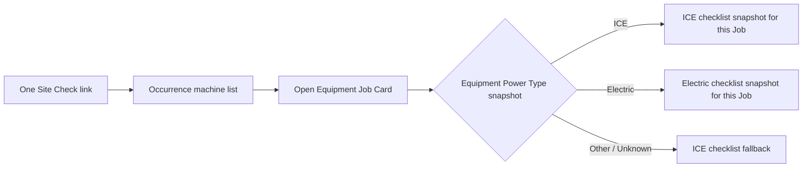

# Site Check Checklist Content Proposal

Status: **Approved and provisioned**

The product owner confirmed that technicians receive one Site Check assignment link, open
one machine Job Card at a time, and receive the checklist appropriate to each machine.
Equipment Power Type in the existing Service Data is the authoritative selector.

## Confirmed existing selector

Equipment column `gr_powertype` is already provisioned, loaded, editable in Service Data,
and documented by `maintenance-programmes-dataverse.md`:

- ICE `122830000`
- Electric `122830001`
- Other / Unknown `122830002`

Do not add another fuel or powertrain classification. Do not infer checklist type from Make,
Model, description, Service Programme, or Site.

## Assignment and checklist model

Each included Equipment still produces one Job. At occurrence creation, resolve that
Equipment's Power Type, choose the matching active Template version, and copy that
Template's items to immutable Snapshot Items owned by the generated Job. The one technician
link lists every generated Job and opens the corresponding per-machine checklist.

Changing Equipment Power Type later affects only future Site Checks. Existing Job snapshot
items, answers, photos, and history remain unchanged.

Other / Unknown intentionally resolves to the ICE Template. This is a checklist-selection
fallback only: Site Check creation must not rewrite `gr_powertype` or claim that the
Equipment was positively classified as ICE. The Run review and machine checklist should
label the selection **ICE checklist (defaulted)** while the Equipment remains Other /
Unknown.

## Provisioned schema correction

The original Snapshot Item contract had a required Site Check lookup and alternate key
Site Check + Item Key. That was insufficient when one occurrence contains ICE and Electric
Jobs with overlapping item keys.

The approved correction was provisioned and structurally verified on 26 July 2026. The
new alternate-key definition exists and its Dataverse index remains `Pending`; confirm it
is `Active` before occurrence integration:

- Add required Job lookup `gr_job` on `gr_sitecheckchecklistsnapshotitem`.
- Retain required Site Check lookup `gr_sitecheck` for efficient occurrence-level loading.
- Replace alternate key Site Check + Item Key with Job + Item Key.
- Keep optional source Template Item lookup for version/content traceability.
- No rows exist yet, so no Snapshot data migration or backfill is required.
- Keep `gr_sitecheckschedule.gr_checklisttemplate` optional but unused in v1. It remains a
  future default/override extension and must not control per-machine selection.

## Templates

### ICE Site Check v1

- Code: `SITE_CHECK_ICE`
- Display name: `ICE Site Check`
- Version: `1`
- Selector: Equipment Power Type = ICE

### Electric Site Check v1

- Code: `SITE_CHECK_ELECTRIC`
- Display name: `Electric Site Check`
- Version: `1`
- Selector: Equipment Power Type = Electric

Both are organisation-wide. Shared questions are deliberately copied into each version so
each Template is independently complete and historical snapshots never depend on another
Template.

## Shared Visual checks

| Order | Stable item key | Prompt |
| ---: | --- | --- |
| 10 | `visual.damage` | Check for bent, dented, or broken parts and inspect seat condition. |
| 20 | `visual.fluid-leaks` | Check under the unit for fluid leaks. |
| 30 | `visual.tyres-wheels` | Check tyres and wheels for damage; confirm wheel nuts are present and tight. |
| 40 | `visual.forks-attachment` | Check forks or carpet probe are in place, straight, and secured by locking pins. |
| 50 | `visual.chains-hoses-cables` | Check chains, hoses, and cables are secure, with no broken links or loose rollers. |
| 60 | `visual.guards` | Check overhead guard and load backrest condition and security. |
| 70 | `visual.safety-devices` | Check flashing, head, brake, and indicator lights and the horn. |
| 80 | `visual.dash-gauges` | Check all dash warning lamps and gauges operate correctly. |

## ICE-only Engine checks

| Order | Stable item key | Prompt |
| ---: | --- | --- |
| 110 | `engine.oil-level` | Check engine oil is between the minimum and maximum marks. |
| 120 | `engine.coolant-hoses` | Check radiator water/coolant level, hoses, and leaks. |
| 130 | `engine.fan-belt` | Check fan belt adjustment and tension. |
| 140 | `engine.fuel-system` | Check for fuel leaks and confirm the tank cap is fitted. |
| 150 | `engine.air-cleaner` | Check air cleaner and pre-cleaner are installed and operating; clean where required. |

## Electric-only Battery checks

| Order | Stable item key | Prompt |
| ---: | --- | --- |
| 210 | `battery.water-level` | Check battery water level is between the minimum and maximum marks. |
| 220 | `battery.connections` | Check connections on the battery, charger, and forklift; remove foreign objects. |
| 230 | `battery.charger` | Check the charger operates correctly. |
| 240 | `battery.security` | Check the battery is securely locked and correctly located. |

## Shared Operational checks

| Order | Stable item key | ICE wording | Electric wording |
| ---: | --- | --- | --- |
| 310 | `operation.functions` | Check machine operation and all fitted functions. | Same |
| 320 | `operation.travel-controls` | Check forward and reverse operation with no unusual noise. | Same |
| 330 | `operation.audible-alarms` | Check horn and reverse beeper. | Same |
| 340 | `operation.brakes` | Check park brake and foot brake operate correctly. | Same |
| 350 | `operation.drive-disconnect` | Check the inch pedal engages and disengages drive. | Check the emergency switch operates correctly. |
| 360 | `operation.steering` | Check steering lock to lock with no unusual noise; grease where applicable. | Same |
| 370 | `operation.hydraulics` | Check raise/lower, tilt, side-shift, and fork-position controls as fitted. | Same |
| 380 | `operation.mast` | Check mast is greased and tilt and bottom pivots are secure. | Same |
| 390 | `operation.other-safety` | Check neutral start, speed governor, and forward/reverse interlock as fitted. | Same |
| 400 | `meter.service-hours` | Record the service meter reading. | Same |

## Response rules

- Every inspection item uses Pass / Fail / Not applicable and is required.
- Fail requires a comment.
- Photographs are optional in v1 unless separately approved.
- Service Meter Reading uses Number and is required.
- Free-form sheet comments map to canonical Job Card notes, not another checklist item.
- Not applicable remains available for equipment-specific fitted options, but technicians
  no longer use it to skip an entire incorrect powertrain section.

## Creation validation

Creation must stop before the atomic write when:

- the matching ICE or Electric Template is missing, inactive, empty, or invalid; or
- snapshot count would exceed the verified atomic request limits.

Missing/null and Other / Unknown Power Type resolve to ICE. The Run drawer must clearly
identify those machines as **ICE checklist (defaulted)** and retain navigation to Equipment
Service Data. This fallback must not update Equipment.

## Approval gate

- [x] One technician assignment link opens all machine Jobs/checklists.
- [x] Select checklist per Equipment using existing Service Data Power Type.
- [x] Preserve one Job and one Job Card per Equipment.
- [x] Resolve missing or Other / Unknown Power Type to ICE without changing Equipment.
- [x] Approve and provision the Snapshot Item Job lookup and Job + Item Key
  alternate-key correction.
- [x] Confirm the provisioned Job + Item Key alternate-key index is `Active`.
- [x] Confirm the four Electric Battery checks.
- [x] Approve mandatory comment-on-fail for every inspection item.
- [x] Approve no mandatory photos in Template version 1.
- [x] Approve Service Meter Reading as a required Number response.
- [x] Approve the exact prompts and stable keys above.

Provisioning note (26 July 2026): a cached no-prompt read-only preflight confirmed neither
approved Template nor any child Item existed. One subsequent cached no-prompt connection
created both Templates and all 45 Items in a single 47-request atomic transaction. Exact
read-back verification passed against `scripts/site-check-checklist-v1.json`. No Site Check,
Job, Equipment, Schedule, Snapshot, Response, or customer rows were created or changed.

Next: resolve Template per Equipment during authoritative occurrence creation and include
each Job's Snapshot Items in the same atomic transaction.
