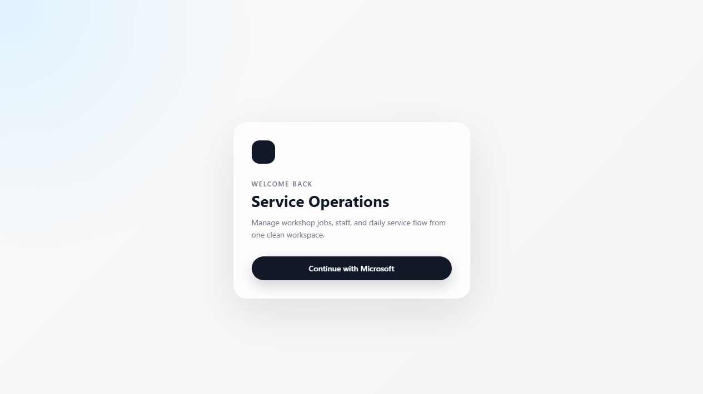

# Getting started and signing in

Service Operations is Liftrucks' workspace for managing operational records. Your work account
determines which parts of the app you can open and which actions you can perform.

## Before you begin

You need:

- your individual Liftrucks Microsoft work account;
- access assigned by the Service Operations administrator; and
- a current web browser such as Microsoft Edge or Google Chrome.

Do not share an account. Each person signs in separately so changes can be traced to the correct user.

## Open Service Operations

Open the V2 pilot site:

**[https://kind-wave-0cdea2200.2.azurestaticapps.net](https://kind-wave-0cdea2200.2.azurestaticapps.net)**

Bookmark this address after confirming that the Service Operations sign-in page has opened.

## Sign in

1. Select **Continue with Microsoft**.
2. Choose your Liftrucks work account. If it is not shown, select **Use another account** and enter
   your work email address.
3. Complete Microsoft's sign-in or verification prompt.
4. Wait for Service Operations to open. Do not repeatedly select the sign-in button while the page
   is returning from Microsoft.
5. Check the name shown at the bottom of the left menu to make sure the correct account is active.

### What a Job Book Admin should see

A Job Book Admin normally lands on **Job Book** and sees these menu items:

- **Job Book**
- **Equipment**
- **Customers**

Seeing fewer options may mean the older access claim is still cached. Seeing operational or review
screens that are not listed above should be reported before continuing.

## Move around the app

Use the menu on the left to change screens. Select the small arrow near the top of the menu to make
it narrower or wider. On a smaller screen, selecting a menu item closes the menu automatically.

Most lists provide search, filters or tabs. Selecting a row or **Edit entry** usually opens a panel
from the right. Use the action button at the bottom of that panel to save, or **Cancel** to leave
without saving.

## If Microsoft asks you to reconnect

If your session expires, the app displays **Reconnect to continue**.

1. Select **Reconnect Microsoft** once.
2. Complete the Microsoft prompt using the same work account.
3. Return to the app. Your current page stays open and the interrupted request continues.

Do not open a second copy of the record while reconnection is in progress.

## If the wrong account or access appears

1. Stop before changing any records.
2. Check the name at the bottom of the left menu.
3. Close all Service Operations tabs, then open the site again.
4. If the old role is still shown after an access change, sign out of Microsoft in that browser and
   sign in again, or use a private browser window for the first fresh sign-in.
5. If the problem remains, send the administrator your work email address and the exact message on
   screen. Never send your password or verification code.

### Common access messages

| Message | Meaning | What to do |
| --- | --- | --- |
| **Access has not been assigned** | Microsoft sign-in succeeded, but the account has no Service Operations app role. | Contact the administrator and provide your work email address. |
| **This area is not available** | The link opened a screen outside your assigned role. | Select **Return to Job Book** or use the left menu. |
| **Reconnect to continue** | The Microsoft session used for Dataverse has expired. | Select **Reconnect Microsoft** once and complete sign-in. |
| A page keeps showing **Loading** or a load warning | The app or data service may be temporarily unavailable. | Wait briefly, use the on-screen retry once, then report the message if it continues. |

## Good habits

- Search before creating a Customer, Site, Equipment record or Job Book entry.
- Read the complete confirmation message before an important action.
- If a save reports that the request was retained, resume that request instead of creating another.
- Never enter passwords, verification codes or customer-sensitive information into support messages.

Next: [Job Book Admin guide](Job-Book-Admin-Guide)

_Last reviewed: 9 October 2026._
